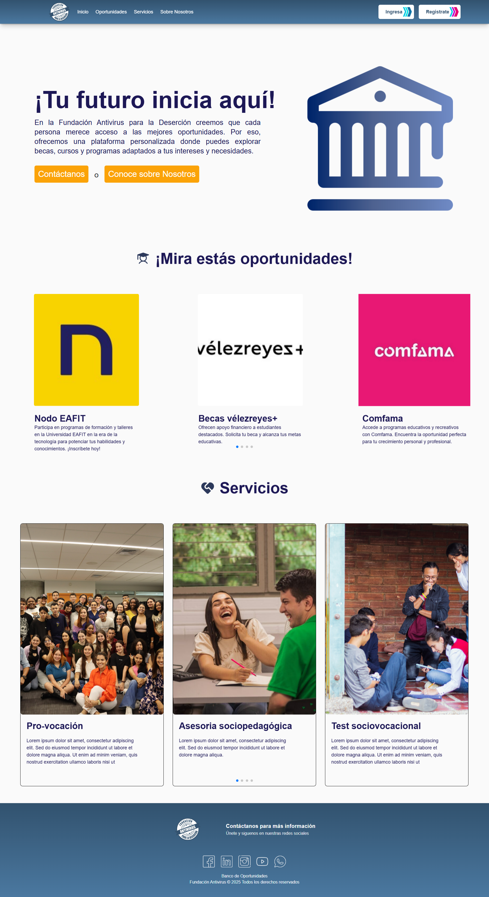
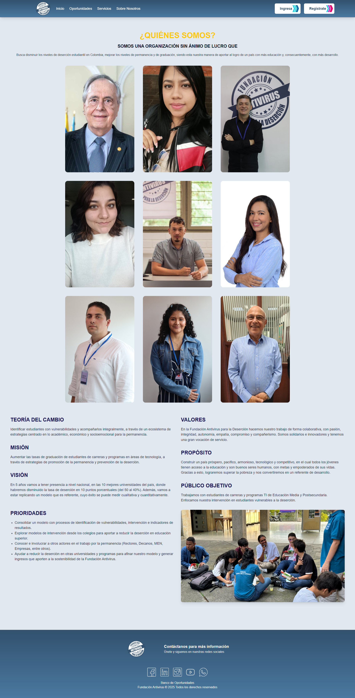
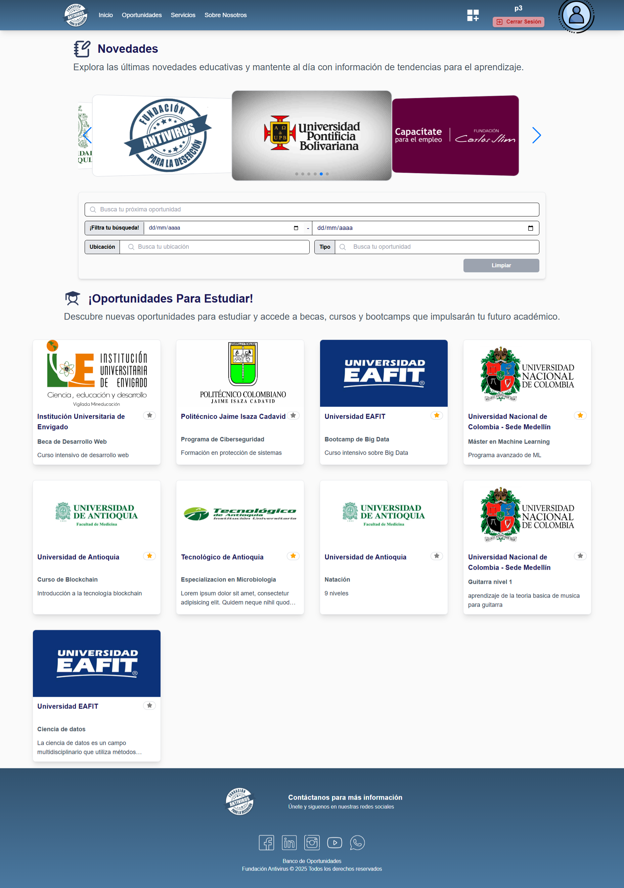
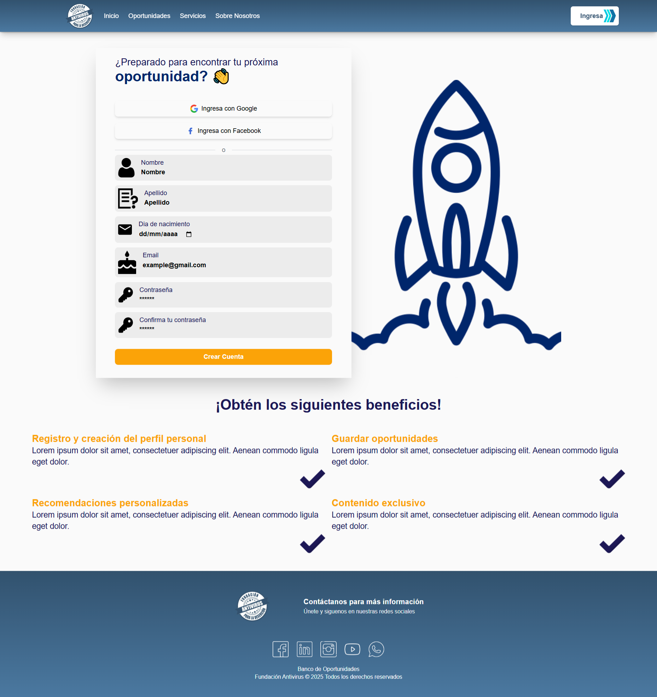
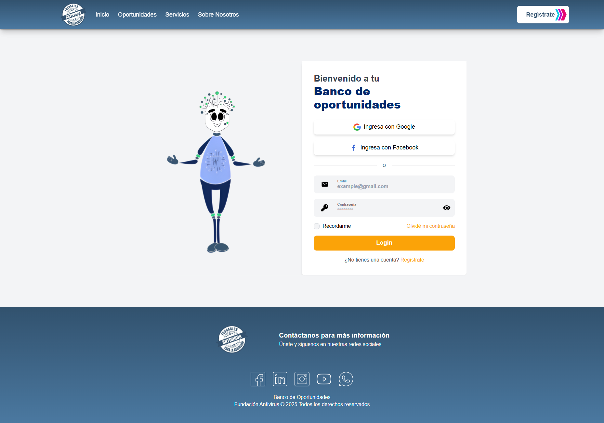
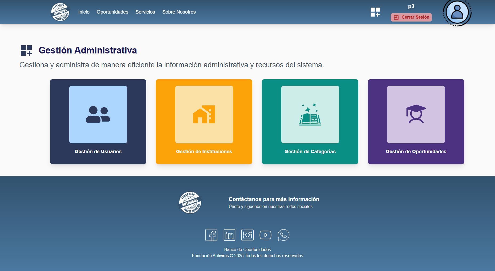
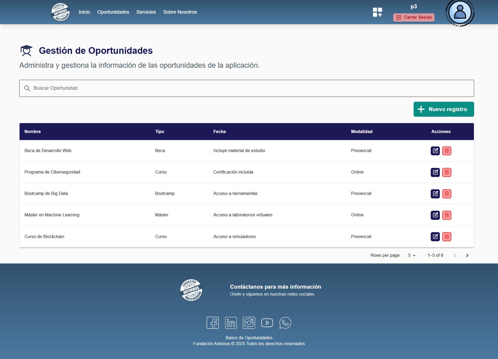

<h1 align="center"> FUNDACIÓN ANTIVIRUS PARA LA DESERCIÓN </h1>

## 🎯 Descripción
Es una plataforma digital que centraliza oportunidades como becas, créditos,
subsidios, cursos y programas de formación laboral, orientando a los usuarios en la
toma de decisiones educativas y profesionales.

## ✨ Caracteristicas y Funcionalidades
1. Visualizar oportunidades educativas y económicas (becas, créditos,
subsidios, cursos, etc.)
2. Registrar y autenticar usuarios, con recuperación de contraseña y
validación por correo electrónico.
3. Administrar perfiles personalizados, incluyendo usuarios comunes y
administradores.
4. Realizar búsquedas avanzadas con filtros por tipo, sector y ubicación de la
oportunidad.
5. Publicar y gestionar oportunidades desde una vista de administración.
6. Realizar donaciones a través de un botón de pago con Wompi.
7. Proporcionar soporte vía WhatsApp, mediante un botón de contacto
directo.
8. Garantizar compatibilidad responsive, accesibilidad y una experiencia de
usuario fluida en múltiples dispositivos.
9. Documentar el sistema con manuales, diagramas y guías de instalación.

## 👀 Capturas Del Proyectos

## 🛠️ Tecnologias y Herramientas

- **Front-End Framework:** Remix React, Tailwind.

- **Librerías de UI/UX:** react-icons, Swiper.js, sweetalert2

- **Lenguajes:** JavaScript, HTML, CSS.

- **Otras Herramientas:** Git, GitHub.

## 🗺️ Como Empezar
Antes de comenzar, asegúrate de tener instalado [**Node.js v22.13.0**](https://nodejs.org/en/download) (o superior) en tu sistema. Ten en cuenta que **npm v11.4.2** se incluye automáticamente con la instalación de Node.js.
### 1.  Clona el repositorio
git clone https://github.com/8SuperNova8/FrontEnd-Antivirus.git

### 2. Navega al directorio del proyecto
cd Nombre-proyecto

### 3. Instala las dependencias
npm install 

### 4. Inicia el servidor de desarrollo
npm run dev

Esto te permitirá ver la interfaz del Frontend. Sin embargo, para que el proyecto funcione completamente, necesitas también configurar el Backend. Puedes encontrar las instrucciones detalladas en el siguiente repositorio: [https://github.com/Backend-API-REST-Antivirus/API-Antivirus](https://github.com/Backend-API-REST-Antivirus/API-Antivirus).

